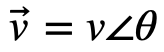
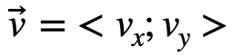
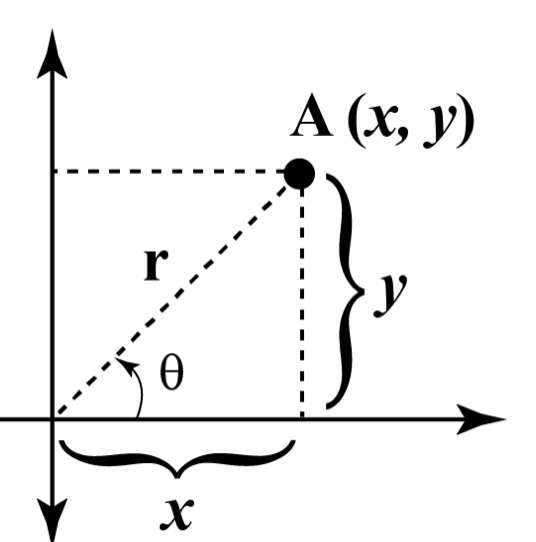
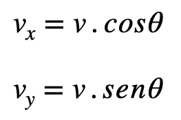
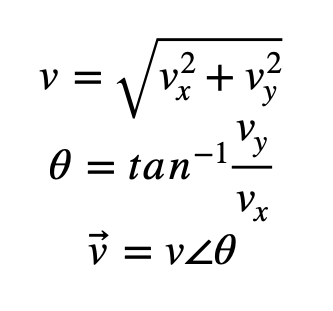

Este programa en c++ es una práctica del uso de condicionales y expresiones matemáticas
y permite convertir coordenadas polares a rectangulares y viceversa.

Un poco de teoría...

Cuando expresamos una magnitud vectorial podemos 
hacerlo de dos formas:

1. Dando su magnitud y el ángulo que forma con la horizontal (dirección y sentido): 

A través de sus componentes: 

A la primera forma de dar información se le conoce como coordenadas polares y 
a la segunda coordenadas rectangulares.

Analizando el diagrama que ya conocemos de las componentes  de un vector vemos que 
podemos obtener una forma de expresar el vector a partir de la otra y viceversa:

Llamemos v al vector que va desde el origen hasta A. Utilizando trigonometría sabemos que:

Que son las componentes rectangulares del vector:

Y aplicando el teorema de Pitágoras y la definición de tangente, podemos obtener el módulo y el ángulo del vector con la horizontal (eje x):

